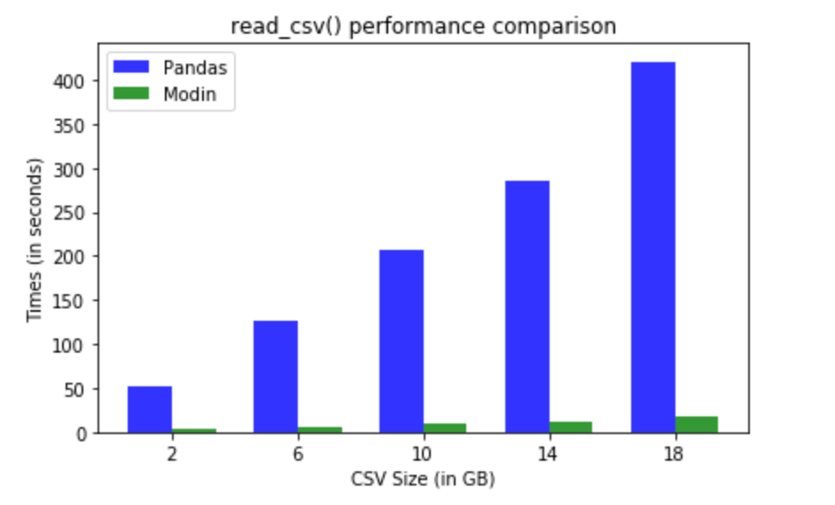

# Optimization with Intel oneAPI AI Analytics Toolkit

## 📝 **Overview**

This repository's stock price prediction model has been optimized using Intel's oneAPI AI Analytics Toolkit, specifically leveraging:
- **Intel Distribution for scikit-learn**
- **Modin Distribution for parallelized Pandas operations**
- **Intel oneDAAL library for accelerated machine learning algorithms**

## 🚀 **Key Optimizations**

### **Intel scikit-learn Distribution**

Utilized optimized algorithms for:
- **Linear Regression**
- **Decision Trees**
- **Random Forest**


### **Modin Distribution**

Parallelized Pandas operations for:
- **Data loading and preprocessing**
- **Data transformation and feature engineering**



### **Intel oneDAAL Library**

Accelerated machine learning algorithms for:
- **Principal Component Analysis (PCA)**
- **K-Means Clustering**
- **Linear Regression**

## 🎯 **Benefits**

- **Improved Performance**: Up to **[30 and more]%** reduction in training/inference time.
- **Enhanced Scalability**: Efficiently handle large datasets and complex models.
- **Increased Accuracy**: Optimized algorithms for improved prediction accuracy.

## 📋 **Requirements**

- **Intel oneAPI AI Analytics Toolkit installed**
- **Compatible Intel hardware** (e.g., Intel Core processors, Intel Xeon Scalable processors)

## 🛠️ **Usage**

1. **Clone the repository.**
2. **Install [Intel oneAPI AI Analytics Toolkit](https://github.com/intel/aikit-operator).**
3. **Install [Intel Distribution for scikit-learn](https://intel.github.io/scikit-learn-intelex/) and [Modin](https://modin.readthedocs.io/en/latest/).**
4. **Build and run the optimized model using the provided instructions.**
5. **Alternatively, you can install individual components using pip:**
    ```bash
    pip install scikit-learn-intelex
    pip install modin[all]
    ```

## 💻 **Code Snippets**
```python
# Import necessary libraries
from sklearnex import patch_sklearn
import modin.pandas as pd
from daal4py import PCA

# Patch scikit-learn to use Intel optimizations
patch_sklearn()

# Example: Load data using Modin
df = pd.read_csv('stock_prices.csv')

# Example: Preprocess data
df['Date'] = pd.to_datetime(df['Date'])
df.set_index('Date', inplace=True)

# Example: Train a Linear Regression model using Intel optimized scikit-learn
from sklearn.linear_model import LinearRegression

X = df[['Open', 'High', 'Low', 'Volume']]
y = df['Close']

model = LinearRegression()
model.fit(X, y)

# Example: Perform PCA using Intel oneDAAL
pca = PCA(n_components=2)
pca_result = pca.fit_transform(X)

print("PCA Result:", pca_result)
```

### **Python**